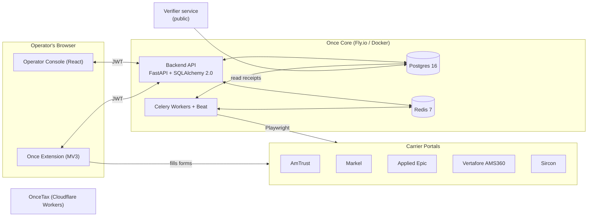

# Once — Architecture

## 1. System overview

Once is composed of five deployable units that all speak a small, stable
HTTP contract. The **browser extension** is the only component that touches
carrier portals directly — everything else is a server-side service.

```
                ┌─────────────────────────────────────────────┐
                │             Operator's Browser              │
                │                                             │
                │  ┌──────────────┐      ┌──────────────────┐ │
                │  │ Once         │      │ Operator Console │ │
                │  │ Extension    │      │ (React/Vite)     │ │
                │  │ (MV3)        │◀────▶│   :5173          │ │
                │  └──────┬───────┘      └────────┬─────────┘ │
                │         │ fills carrier         │           │
                │         │ portal forms          │ JWT       │
                └─────────┼───────────────────────┼───────────┘
                          ▼                       ▼
              ┌─────────────────────┐    ┌──────────────────────┐
              │ Carrier Portals     │    │ Backend API (FastAPI)│
              │ AmTrust / Markel /  │    │   :8000              │
              │ Applied Epic / …    │    │  ─ Auth, Tenants     │
              └─────────────────────┘    │  ─ Suppliers, Portals│
                                         │  ─ Submissions       │
                                         │  ─ Receipts          │
                                         └─────┬────────────┬───┘
                                               │            │
                                  Celery tasks │            │ SQL
                                       (Redis) │            │
                                               ▼            ▼
                                       ┌────────────┐  ┌──────────┐
                                       │  Celery    │  │ Postgres │
                                       │  Workers   │  │   16     │
                                       │  + Beat    │  └──────────┘
                                       └─────┬──────┘
                                             │ Playwright (sync,
                                             │ bridged via
                                             │ asyncio.to_thread)
                                             ▼
                                  ┌────────────────────────┐
                                  │  Carrier Portals       │
                                  │  (server-side bots,    │
                                  │   when allowed)        │
                                  └────────────────────────┘

      ┌──────────────────────────┐        ┌──────────────────────────┐
      │ Verifier service         │        │ OnceTax (Wedge B)        │
      │ (public, read-only)      │        │ Remix on Cloudflare       │
      │   GET /verify/{id}       │        │ Workers + D1 + R2 + KV   │
      │   → {payload, sig, pk,   │        │ Shopify Subscription     │
      │      verified: true}     │        │ Billing API              │
      └──────────────────────────┘        └──────────────────────────┘
```

### Mermaid view



## 2. Component responsibilities

| Component | Stack | Responsibility |
|---|---|---|
| **Backend API** | FastAPI, SQLAlchemy 2.0 async, Pydantic v2, Alembic | Authn/z, tenant isolation, CRUD for suppliers/portals/submissions, queues submissions, exposes receipts, JWKS for verifier. |
| **Celery workers** | Celery 5, Redis broker, Playwright sync | Runs the **submission pipeline** (atomic claim → submitter dispatch → receipt sign). Also runs renewal monitor, sanctions screen, smoke tests. |
| **Operator console** | React 18, Vite, Tailwind, TanStack Query, Zustand | Operator-facing UI: portals, suppliers, submission queue, receipts, consent ledger. |
| **Browser extension** | MV3, Vite + @crxjs, React popup, vanilla TS content scripts, AES-GCM-256 vault in IndexedDB | Captures profile fields once; auto-fills carrier portal forms; pushes the resulting submission record + payload hash to the backend. |
| **Verifier** | Tiny FastAPI service | Public, read-only `/verify/{receipt_id}` endpoint. Fetches receipt, fetches public key (JWKS), verifies Ed25519 signature, returns `{payload, sig, public_key, verified: bool}`. Stateless w.r.t. tenant data — only sees what's already public. |
| **OnceTax** | Remix on Cloudflare Workers, D1, R2, KV, Shopify Subscription Billing | Wedge-B sales-tax SaaS — separate stack, separate threat surface. |

## 3. Data flow — signed submission receipt

This is the most important flow in the system. Every successful submission
produces a tamper-evident receipt that the supplier (or any auditor) can
verify forever, even if Once is gone.

```
1. Operator opens carrier portal in browser.
      Extension content script detects portal (PortalPlatform enum)
      and fills fields from the encrypted vault.

2. Extension POSTs the submission intent to backend:
      POST /v1/submissions
        { supplier_id, portal_id, fields_submitted (canonical),
          consent_record_id, tos_text_seen }
      → creates SupplierSubmission(status=QUEUED), returns id.

3. Celery worker picks it up:
      app.services.submission_pipeline.process_submission(submission_id)
        a. Atomic claim:
             UPDATE supplier_submissions
                SET status='running'
              WHERE id=:id AND status IN ('queued','retrying')
           rowcount must == 1, else abort.

        b. Dispatch:
             submitter = _get_submitter(submission.portal.platform)
             result = await submitter.submit(submission)

        c. On success, build ReceiptPayload:
             {
               receipt_id,         # new uuid
               tenant_id,
               supplier_id,
               portal,             # PortalPlatform.value
               submission_id,
               submitted_at,       # ISO8601 UTC
               payload_hash,       # sha256(canonical_json(fields_submitted))
               tos_version_hash,   # sha256(portal_tos_text_at_time)
               consent_record_id,
             }

        d. Sign:
             signed_bytes = canonical_json(payload).encode()
             sig          = Ed25519(settings.RECEIPT_SIGNING_PRIVATE_KEY_PEM)
                              .sign(signed_bytes)

        e. Persist SubmissionReceipt(payload, sig, key_id=RECEIPT_SIGNING_KEY_ID)
           and flip SupplierSubmission.status = COMPLETED.

        f. Append AuditLog row (append-only, never updated).

4. Anyone — even the supplier years later — can verify:
      GET https://verify.once.io/verify/{receipt_id}
        → { payload, sig, public_key, verified: true }
      The verifier:
        - Loads payload+sig from the DB,
        - Loads public key for `key_id` from /v1/keys/{key_id},
        - Recomputes signed_bytes = canonical_json(payload).encode(),
        - Ed25519.verify(public_key, sig, signed_bytes),
        - Returns the boolean alongside the inputs so the auditor can
          re-verify offline with any Ed25519 library.
```

### Canonical JSON

Receipts are signed over **canonical JSON** (`app.utils.canonical_json`) —
RFC-8785-style sorted keys, no insignificant whitespace, `\uXXXX` escapes
for non-ASCII. This guarantees the byte sequence we sign is the byte
sequence any third-party verifier will reconstruct.

### Key rotation

Signing keys are identified by `RECEIPT_SIGNING_KEY_ID`. Old keys remain
queryable via `GET /v1/keys/{key_id}` so historical receipts stay verifiable
after a rotation. See [`docs/RUNBOOK.md`](docs/RUNBOOK.md).

## 4. Trust boundaries

- **Tenant ↔ tenant** — enforced in DB by `tenant_id` FK on every
  tenant-scoped row, and in code by `tenant_scope` middleware that reads
  `request.state.tenant_id` from the JWT and injects a `WHERE` clause into
  service-layer queries.
- **Browser ↔ backend** — JWT access tokens (15 min) + refresh (30 days),
  HS256. CSRF double-submit cookie on state-changing browser routes.
- **Extension vault ↔ disk** — vault is AES-GCM-256 in IndexedDB, key
  derived from passphrase via PBKDF2-SHA256 (310k iterations). The
  passphrase never leaves the browser.
- **Receipt signer ↔ everything else** — the Ed25519 private key lives only
  in the worker process env (`RECEIPT_SIGNING_PRIVATE_KEY_PEM`). The API
  and frontend never see it.

## 5. Deployment topology

| Service | Where | Notes |
|---|---|---|
| backend (api, worker, beat) | Fly.io, primary region `iad` | One Fly app, three processes (`web`, `worker`, `beat`). See [`fly.toml`](fly.toml). |
| postgres | Fly Postgres or managed PG | Daily base backup + WAL archiving. |
| redis | Fly Upstash Redis | Broker + rate-limit store. |
| frontend | Cloudflare Pages / Fly static | Built artifact only; no SSR. |
| verifier | Fly.io, separate app | Public, read-only. |
| oncetax | Cloudflare Workers | Wrangler deploy. |

See [`docs/RUNBOOK.md`](docs/RUNBOOK.md) for the operator playbook.
