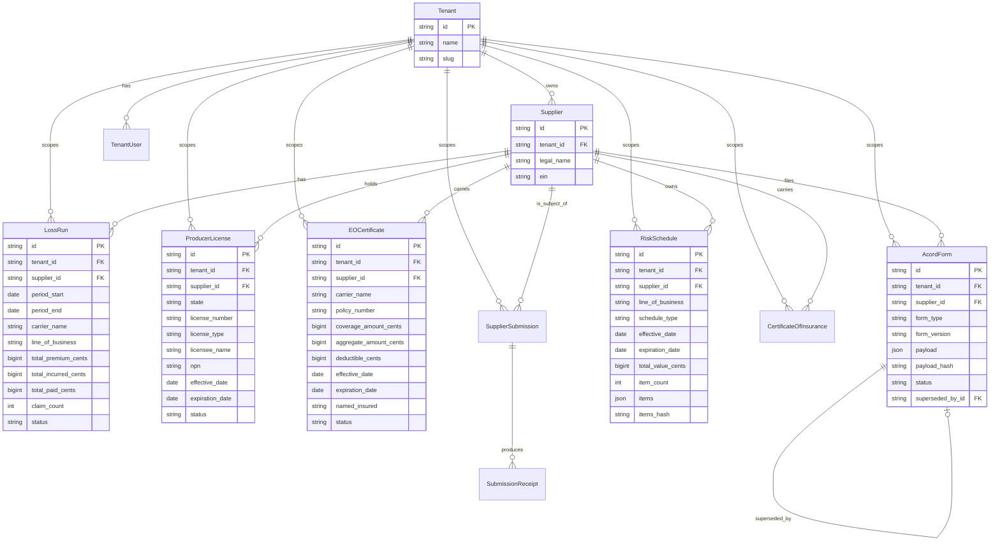

# Once — Submission-Artifact Data Model

> Status: production schema as of revision `20260520_03_submission_artifacts`.
> This document covers the five **submission-artifact** entities introduced
> for L2.6 (LossRun, ProducerLicense, EOCertificate, AcordForm,
> RiskSchedule) and their relationship to the existing tenant/supplier
> graph.

## 1. Entity-relationship diagram

## 2. Entity guide

### 2.1 LossRun
A **loss run** is the carrier-issued claims-history report for a producer
or insured over a stated policy period. An MGA uploads loss runs into
Once when submitting a risk to a *new* carrier — the new carrier will
not bind until they have seen 3–5 years of clean (or appropriately
priced) loss history for the line in question.

Once stores both the original artifact reference (`file_id` +
`file_sha256`) and the normalized aggregates (premium / incurred / paid /
count) so dashboards, underwriting heuristics, and renewal monitors can
work without re-parsing PDFs. All money columns are `BigInteger` cents —
never floats. `status` walks the lifecycle
`uploaded → processing → parsed | error`.

### 2.2 ProducerLicense
A **producer license** is the state-issued credential authorizing an
agent or broker (or MGA, or wholesaler, or surplus-lines licensee) to
solicit, negotiate, or sell insurance in a given US state. Every active
producer must hold a license in every state in which they place
business; lapsed licenses block bindings.

Once enforces uniqueness on `(tenant, supplier, state, license_number)`
to prevent accidental duplicates and indexes `(tenant, expiration_date)`
for the renewal-monitor scan that surfaces licenses expiring inside the
30-day window. The optional `npn` (National Producer Number) is the
cross-state identifier issued by NIPR.

### 2.3 EOCertificate
**Errors & Omissions** insurance is professional-liability coverage that
protects a producer against claims of negligence or failure to perform.
Carriers and many state DOIs require proof of active E&O before
appointing a producer or accepting submissions on their behalf.

We track per-claim and aggregate limits + the deductible (all in cents),
the named insured, and an optional list of additional insureds (often
the carriers that requested to be added). The `(tenant, expiration_date)`
index powers the same renewal-monitor cron as ProducerLicense.

### 2.4 AcordForm
**ACORD** (Association for Cooperative Operations Research and
Development) publishes the standard family of P&C insurance forms used
across the industry:

| Form | Use |
|------|-----|
| 25   | Certificate of Insurance |
| 125  | Commercial Insurance Application — applicant section |
| 126  | Commercial General Liability section |
| 127  | Business Auto section |
| 130  | Workers Compensation section |
| 140  | Property section |

We persist the *payload* (a structured dict matching the form's
canonical fields) and compute `payload_hash` from the canonical-JSON
encoding so callers can cheaply detect changes between revisions. The
service layer recomputes `payload_hash` on every create/update so the
hash and payload can never desync.

Versioning is linear: an older form's `superseded_by_id` points to the
new revision, and the service flips the predecessor's `status` to
`superseded` automatically when the link is set.

### 2.5 RiskSchedule
A **risk schedule** is the spreadsheet of specific risks a submission
covers — VINs for Commercial Auto, locations for Commercial Property,
employees + class codes for Workers Comp, equipment serial numbers for
Inland Marine. We persist the heterogeneous items as a JSON array and
store its canonical SHA-256 as `items_hash` so mid-flight schedule
changes (a common cause of carrier re-rates) can be detected at audit
time. `item_count` is always forced to `len(items)` by the service so
the two cannot desync.

#### Conventional item shapes (informational — not enforced at the DB)

| schedule_type           | item shape (typical keys)                                  |
|-------------------------|-----------------------------------------------------------|
| `vehicle_schedule`      | `vin`, `year`, `make`, `model`, `garaging_zip`, `value_cents`, `radius` |
| `location_schedule`     | `address`, `city`, `state`, `zip`, `construction_class`, `tiv_cents` |
| `employee_schedule`     | `class_code`, `state`, `payroll_cents`, `headcount`        |
| `equipment_schedule`    | `description`, `serial_number`, `acv_cents`, `replacement_cost_cents` |

## 3. Cross-cutting invariants

* **Tenancy** — every row carries `tenant_id` with `ON DELETE CASCADE`.
  Cross-tenant access never returns 403; it returns 404 so the API does
  not leak existence.
* **Supplier scoping** — `supplier_id` FK cascades on supplier delete so
  removing a supplier removes all artifacts atomically.
* **Money** — all currency is `BigInteger` cents. There is no `Numeric`
  / `Float` column anywhere in this layer.
* **Hashes** — all `*_sha256` columns are lowercase hex SHA-256 (64
  chars). Pydantic validators enforce the format.
* **Enums** — stored as `String(32)` (or `String(16)`), with Python
  `enum.Enum` subclasses providing canonical values. The DB stays
  SQLite-portable; we do not use native ENUM types or JSONB.
* **Auditing** — every create/update/delete writes an `AuditLog` entry
  (`{resource_type}.{action}`) tagged with the actor user id and the
  source IP.

## 4. Migration

* Revision id: `20260520_03_submission_artifacts`
* Down revision: `20260519_02_signing_keys`
* Adds 5 tables, 19 indexes (including 4 composite tenant-scoped
  indexes), 1 unique constraint, 6 check constraints.

## 5. Future work

* **AI extraction** — auto-populate normalized fields (premium / incurred
  / paid for `LossRun`, licensee/effective/expiration for
  `ProducerLicense`, etc.) from uploaded PDFs via an OCR + LLM pipeline.
  The empty `metadata_json` slot reserves space for extraction
  provenance (model id, prompt hash, confidence per field).
* **Files table** — promote `file_id` / `pdf_file_id` / `source_file_id`
  from opaque strings to FK references to a dedicated `files` table
  backed by object storage (S3/R2) with content-addressed keys.
* **Renewal alerts** — Celery beat task scanning
  `(tenant, expiration_date)` indexes on `ProducerLicense` and
  `EOCertificate` daily; emit notifications at T-60, T-30, T-7.
* **Change-detection diffing** — given two `AcordForm` revisions sharing
  a supplier + form_type, surface a structured diff of the payload so
  underwriters can see *exactly* what changed between submissions.
* **Cross-tenant carrier table** — promote free-text `carrier_name`
  fields to a normalized `carriers` table once we have a reliable
  carrier registry (currently heterogeneous to allow rapid onboarding).
* **Lines-of-business reference table** — once OFAC/sanctions and carrier
  appointment data are integrated, line codes will need a richer model
  than the flat enum used here.
